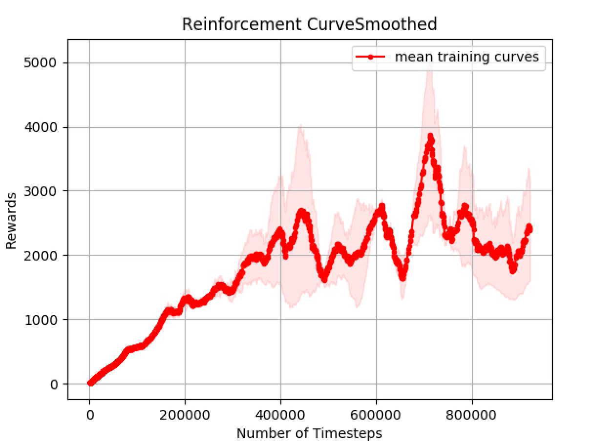

# Robust Grasping
======

**Reimplementation of "Robust Adversarial RL" Paper (https://arxiv.org/abs/1703.02702)

Requirements
======

- mujoco_py==0.5.0
- mjpro131
- Fork of OpenAI gym [https://github.com/lerrel/gym-adv]
- Tensorflow>=1.5
- Latest OpenAI baselines


Usage
============
- [MPI multiprocessing] (mpi installed)
	* Enable 8 workers: `mpirun -np 8 python main_mujoco_robust.py`

- [PPO & Robust Agent]
    * PPO.py
    * PPO_RARL.py
    * Policy network: MlpPolicy.py

- [Training]
    * Train robust agent: `python main_mujoco_robust.py`
	* Train ppo agent: `python main_mujoco_ppo.py`
	* Eval agent: `python eval.py`

- [Visualization]
    * Plot with variation `python visualize.py`

```
usage: run_mujoco_ppo.py [-h] [--env ENV] [--seed SEED] [--sr SR]

optional arguments:
  -h, --help   show this help message and exit
  --env ENV    environment ID (default: HopperAdv-v1)
  --seed SEED  RNG seed (default: 10)
  --sr SR      success reward (default: 3800.0)
```



To-do list
============
- [x] Add rendering code for adversarial force in gym-adv
- [x] Add new robotic manipulation environment